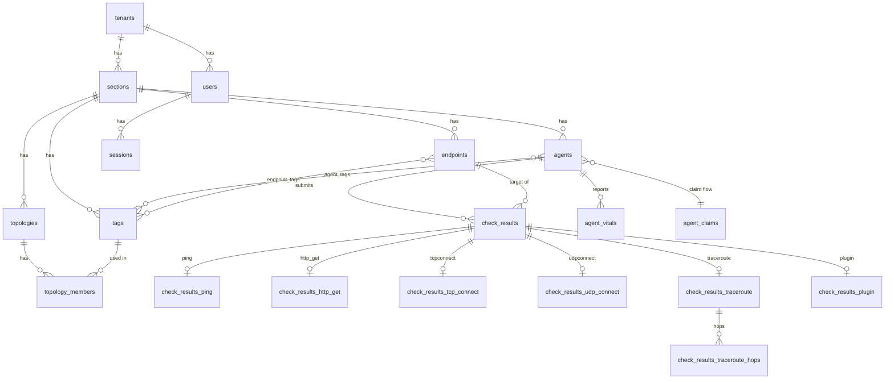

# Schema reference

## ER diagram



---

## Tables

### `tenants`

Top-level isolation boundary.

| Column | Type | Notes |
|--------|------|-------|
| `id` | TEXT PK | UUIDv7 |
| `name` | TEXT UNIQUE | Human-readable name |
| `created_at` | TIMESTAMPTZ | |

---

### `users`

OAuth2-authenticated users, one per provider identity.

| Column | Type | Notes |
|--------|------|-------|
| `id` | TEXT PK | UUIDv7 |
| `tenant_id` | TEXT FK→tenants | |
| `oauth_provider` | TEXT | e.g. `github`, `google`, `microsoft` |
| `oauth_subject` | TEXT | `sub` claim from the IDP |
| `display_name` | TEXT | |
| `email` | TEXT | Nullable |
| `avatar_url` | TEXT | Nullable |
| `last_login_at` | TIMESTAMPTZ | Nullable |
| `created_at` | TIMESTAMPTZ | |
| `updated_at` | TIMESTAMPTZ | Updated by trigger on profile field changes |

**Unique constraint:** `(oauth_provider, oauth_subject)`

---

### `sections`

Subdivision of a tenant (e.g. geographic region, business unit).

| Column | Type | Notes |
|--------|------|-------|
| `id` | TEXT PK | UUIDv7 |
| `tenant_id` | TEXT FK→tenants | |
| `name` | TEXT | |

**Unique constraint:** `(tenant_id, name)`

---

### `tags`

Named labels attached to agents or endpoints to drive topology resolution.

| Column | Type | Notes |
|--------|------|-------|
| `id` | TEXT PK | UUIDv7 |
| `section_id` | TEXT FK→sections | |
| `name` | TEXT | |
| `scope` | TEXT | `agent` \| `endpoint` \| `global` |

**Unique constraint:** `(section_id, name)`

Scope controls trigger ripple direction: `agent` tags ripple to agents, `endpoint` tags ripple to endpoints (and then to agents in that section), `global` does both.

---

### `agent_claims`

Transient table. An agent self-registers here before a user claims it. Deleted (or expired) after the API key is delivered.

| Column | Type | Notes |
|--------|------|-------|
| `id` | TEXT PK | UUIDv7, agent-generated |
| `claim_token_hash` | TEXT | SHA-256 of the claim token |
| `hostname` | TEXT | Used as the initial agent name |
| `agent_version` | TEXT | |
| `ip_addresses_json` | JSONB | Array of `AgentNetworkInterface` |
| `claim_token_expires_at` | TIMESTAMPTZ | Claim window (typically 10 min) |
| `poll_count` | INTEGER | How many times agent has polled (backoff signal) |
| `last_seen_at` | TIMESTAMPTZ | |
| `created_at` | TIMESTAMPTZ | |
| `claimed_at` | TIMESTAMPTZ | Set when a user claims the agent |
| `claimed_by_user_id` | TEXT FK→users | Nullable; SET NULL on user delete |
| `api_key_plaintext` | TEXT | Temporary; cleared after delivery |
| `api_key_delivered` | BOOLEAN | Set to TRUE once agent has received the key |

Cleanup query (run by a background job):
```sql
DELETE FROM agent_claims
WHERE claim_token_expires_at < NOW()
   OR (claimed_at IS NOT NULL AND api_key_delivered = TRUE);
```

---

### `agents`

Claimed, active monitoring agents.

| Column | Type | Notes |
|--------|------|-------|
| `id` | TEXT PK | UUIDv7 |
| `section_id` | TEXT FK→sections | |
| `name` | TEXT | Display name |
| `api_key_hash` | TEXT | SHA-256 of the agent's API key |
| `base_config` | JSONB | Agent configuration blob |
| `config_version` | INTEGER | Incremented by triggers on any config-relevant change |
| `agent_version` | TEXT | Nullable; reported by agent |
| `ip_addresses_json` | JSONB | Array of `AgentNetworkInterface` |
| `last_seen_at` | TIMESTAMPTZ | Nullable; last heartbeat/config fetch |
| `last_result_submitted_at` | TIMESTAMPTZ | Nullable |
| `updated_at` | TIMESTAMPTZ | |
| `created_at` | TIMESTAMPTZ | When claimed |

---

### `agent_tags` (junction)

| Column | Type |
|--------|------|
| `agent_id` | TEXT FK→agents |
| `tag_id` | TEXT FK→tags |

PK: `(agent_id, tag_id)`

---

### `endpoints`

Monitoring targets. Can represent an external service or one of the platform's own agents.

| Column | Type | Notes |
|--------|------|-------|
| `id` | TEXT PK | UUIDv7 |
| `section_id` | TEXT FK→sections | |
| `address` | TEXT | IP or hostname |
| `port` | INTEGER | Nullable |
| `enabled` | BOOLEAN | |
| `is_agent` | BOOLEAN | TRUE when this endpoint represents a platform agent |
| `linked_agent_id` | TEXT FK→agents | Nullable; SET NULL on agent delete |
| `updated_at` | TIMESTAMPTZ | |
| `created_at` | TIMESTAMPTZ | |

---

### `endpoint_tags` (junction)

| Column | Type |
|--------|------|
| `endpoint_id` | TEXT FK→endpoints |
| `tag_id` | TEXT FK→tags |

PK: `(endpoint_id, tag_id)`

---

### `topologies`

Defines a monitoring assignment between a set of agent tags and a set of endpoint tags.

| Column | Type | Notes |
|--------|------|-------|
| `id` | TEXT PK | UUIDv7 |
| `section_id` | TEXT FK→sections | |
| `name` | TEXT | |
| `type` | TEXT | `full-mesh` \| `hub-and-spoke` \| `one-way` |
| `enabled` | BOOLEAN | |
| `updated_at` | TIMESTAMPTZ | |
| `created_at` | TIMESTAMPTZ | |

**Unique constraint:** `(section_id, name)`

---

### `topology_members` (junction)

Maps tags into a topology with a role.

| Column | Type | Notes |
|--------|------|-------|
| `topology_id` | TEXT FK→topologies | |
| `tag_id` | TEXT FK→tags | |
| `role` | TEXT | `monitor` \| `target` |

PK: `(topology_id, tag_id, role)` — a tag can appear as both `monitor` and `target` within one topology, which is what enables a single-tag full-mesh.

---

### `check_results` *(TimescaleDB hypertable in prod)*

One row per check execution. Partitioned by `checked_at`.

| Column | Type | Notes |
|--------|------|-------|
| `id` | TEXT | UUIDv7, agent-generated; used for deduplication |
| `agent_id` | TEXT FK→agents | |
| `endpoint_id` | TEXT FK→endpoints | |
| `check_type` | TEXT | `ping` \| `traceroute` \| `tcpconnect` \| `udpconnect` \| `httpget` \| `plugin` |
| `success` | BOOLEAN | |
| `checked_at` | TIMESTAMPTZ | Agent clock |
| `received_at` | TIMESTAMPTZ | Server receipt time |

**PK (prod):** `(id, checked_at)` — compound key required by TimescaleDB.

Each row has exactly one matching row in the appropriate child table below.

---

### `check_results_ping`

| Column | Type |
|--------|------|
| `check_id` | TEXT PK |
| `resolved_ip` | TEXT |
| `successes` | INTEGER |
| `failures` | INTEGER |
| `success_latencies_json` | JSONB |
| `errors_json` | JSONB (nullable) |

---

### `check_results_http_get`

| Column | Type |
|--------|------|
| `check_id` | TEXT PK |
| `status_code` | INTEGER |
| `response_time_ms` | DOUBLE PRECISION (nullable) |
| `response_size_bytes` | INTEGER (nullable) |
| `errors_json` | JSONB (nullable) |

---

### `check_results_tcp_connect`

| Column | Type |
|--------|------|
| `check_id` | TEXT PK |
| `resolved_ip` | TEXT |
| `connected` | BOOLEAN |
| `connect_time_ms` | DOUBLE PRECISION (nullable) |
| `errors_json` | JSONB (nullable) |

---

### `check_results_udp_connect`

| Column | Type |
|--------|------|
| `check_id` | TEXT PK |
| `resolved_ip` | TEXT |
| `probe_successful` | BOOLEAN |
| `response_time_ms` | DOUBLE PRECISION (nullable) |
| `errors_json` | JSONB (nullable) |

---

### `check_results_traceroute`

| Column | Type |
|--------|------|
| `check_id` | TEXT PK |
| `target_reached` | BOOLEAN |
| `errors_json` | JSONB (nullable) |

---

### `check_results_traceroute_hops`

One row per hop per traceroute. Enables per-hop SQL analytics.

| Column | Type | Notes |
|--------|------|-------|
| `id` | TEXT PK | UUIDv7, server-generated |
| `check_id` | TEXT | References `check_results_traceroute.check_id` |
| `hop` | INTEGER | TTL / hop number |
| `resolved_ip` | TEXT | Nullable (timed-out hops have no address) |
| `hostname` | TEXT | Nullable |
| `success_latencies_json` | JSONB | |

Useful queries:
```sql
-- Latency profile for one traceroute
SELECT hop, resolved_ip, success_latencies_json
FROM check_results_traceroute_hops
WHERE check_id = $1
ORDER BY hop;

-- Average latency at hop 5 across all recent traceroutes
SELECT avg((elem)::double precision)
FROM check_results_traceroute_hops,
     jsonb_array_elements_text(success_latencies_json) AS elem
WHERE hop = 5;
```

---

### `check_results_plugin`

| Column | Type |
|--------|------|
| `check_id` | TEXT PK |
| `plugin_name` | TEXT |
| `plugin_version` | TEXT |
| `success` | BOOLEAN |
| `response_time_ms` | DOUBLE PRECISION (nullable) |
| `errors_json` | JSONB (nullable) |
| `data_json` | JSONB |

---

### `agent_vitals` *(TimescaleDB hypertable in prod)*

Periodic host-resource snapshots. Partitioned by `reported_at`.

| Column | Type | Notes |
|--------|------|-------|
| `id` | TEXT | UUIDv7, server-generated |
| `agent_id` | TEXT FK→agents | |
| `agent_version` | TEXT | Nullable |
| `config_version` | INTEGER | Nullable |
| `is_running` | BOOLEAN | Nullable |
| `checks_performed` | INTEGER | Nullable |
| `checks_successful` | INTEGER | Nullable |
| `checks_failed` | INTEGER | Nullable |
| `failed_report_count` | INTEGER | Nullable |
| `server_connected` | BOOLEAN | Nullable |
| `cache_capacity` | INTEGER | Nullable |
| `cache_len` | INTEGER | Nullable |
| `cpu_pct` | DOUBLE PRECISION | 0.0–100.0; nullable |
| `mem_used_mb` | DOUBLE PRECISION | Nullable |
| `mem_total_mb` | DOUBLE PRECISION | Nullable |
| `system_uptime_secs` | INTEGER | Nullable |
| `agent_uptime_secs` | INTEGER | Nullable |
| `started_at` | TIMESTAMPTZ | Nullable |
| `stopped_at` | TIMESTAMPTZ | Nullable |
| `reported_at` | TIMESTAMPTZ | Agent clock |
| `received_at` | TIMESTAMPTZ | Server receipt time |

**PK (prod):** `(id, reported_at)` — compound key required by TimescaleDB.

---

### `oauth2_pending_states`

Short-lived CSRF/flow state for the OAuth2 authorize → callback → token sequence. One-time use; deleted at `/token`.

| Column | Type | Notes |
|--------|------|-------|
| `id` | TEXT PK | UUIDv7 |
| `state` | TEXT UNIQUE | Client CSRF parameter |
| `provider` | TEXT | e.g. `github`, `google` |
| `auth_code` | TEXT | Filled in at `/callback`; nullable until then |
| `created_at` | TIMESTAMPTZ | |
| `expires_at` | TIMESTAMPTZ | `created_at + 10 minutes` |

---

### `sessions`

Long-lived server-managed sessions. The plaintext token is never stored.

| Column | Type | Notes |
|--------|------|-------|
| `id` | TEXT PK | UUIDv7 |
| `user_id` | TEXT FK→users | |
| `token_hash` | TEXT UNIQUE | SHA-256 of the opaque plaintext token |
| `created_at` | TIMESTAMPTZ | |
| `sliding_expires_at` | TIMESTAMPTZ | Extended on each IDP refresh; capped at `expires_at` |
| `expires_at` | TIMESTAMPTZ | Hard cap: `created_at + 90 days` |
| `last_used_at` | TIMESTAMPTZ | |
| `revoked` | BOOLEAN | |
| `oauth2_provider` | TEXT | |
| `oauth2_access_token` | TEXT | Stored server-side only |
| `oauth2_refresh_token` | TEXT | Nullable |
| `oauth2_token_expiry` | TIMESTAMPTZ | Nullable |
| `oauth2_id_token` | TEXT | OIDC id_token; used as `id_token_hint` on logout |
| `oauth2_scope` | TEXT | Nullable |
| `oauth2_token_type` | TEXT | Default `Bearer` |
| `oauth2_token_refresh_count` | INTEGER | |
| `oauth2_token_refresh_last_at` | TIMESTAMPTZ | Nullable |

---

## Triggers

All triggers fire in response to data changes and keep `config_version` and `updated_at` consistent automatically.

| Trigger | Table | Event | Effect |
|---------|-------|-------|--------|
| `trg_users_updated` | `users` | BEFORE UPDATE of profile fields | Sets `updated_at = NOW()` |
| `trg_agents_updated` | `agents` | BEFORE UPDATE of core fields | Increments `config_version`, sets `updated_at` |
| `trg_endpoints_updated` | `endpoints` | BEFORE UPDATE of `address`, `enabled` | Sets `updated_at`; bumps `config_version` for all agents in section |
| `trg_endpoints_inserted` | `endpoints` | AFTER INSERT | Bumps `config_version` for all agents in section |
| `trg_endpoints_deleted` | `endpoints` | AFTER DELETE | Bumps `config_version` for all agents in section |
| `trg_tag_name_updated` | `tags` | AFTER UPDATE of `name` | Ripples to agents (agent/global scope) and endpoints (endpoint/global scope) |
| `trg_agent_tags_changed` | `agent_tags` | AFTER INSERT | Bumps `config_version` for the agent if tag is agent/global scope |
| `trg_endpoint_tags_changed` | `endpoint_tags` | AFTER INSERT | Updates endpoint `updated_at`; bumps `config_version` for section agents |
| `trg_endpoint_tags_deleted` | `endpoint_tags` | AFTER DELETE | Bumps `config_version` for section agents |
| `trg_topologies_inserted` | `topologies` | AFTER INSERT | Bumps `config_version` for all agents in section |
| `trg_topologies_updated` | `topologies` | BEFORE UPDATE of `name`, `type`, `enabled` | Sets `updated_at`; bumps `config_version` for section agents |
| `trg_topology_members_inserted` | `topology_members` | AFTER INSERT | Bumps `config_version` for section agents |
| `trg_topology_members_updated` | `topology_members` | AFTER UPDATE of `role` | Bumps `config_version` for section agents |
| `trg_topology_members_deleted` | `topology_members` | AFTER DELETE | Bumps `config_version` for section agents |
